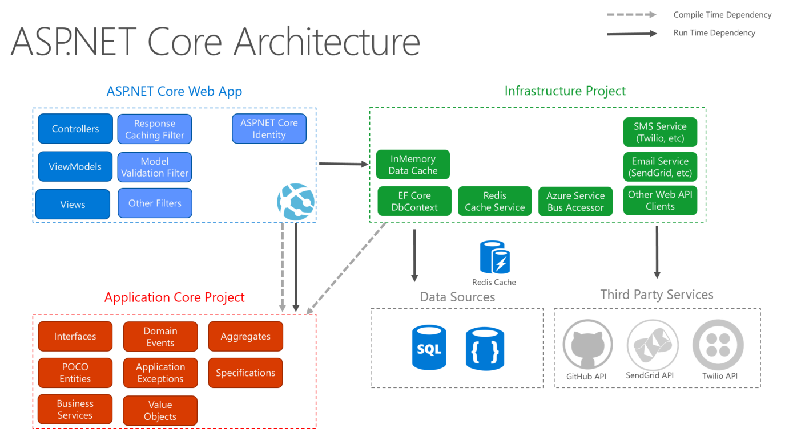

# Clean Architecture
Clean architecture is a software design philosophy that separates the elements of a design into ring levels. An essential goal of clean architecture is to provide developers with a way to organize code so that it encapsulates the business logic but keeps it separate from the delivery mechanism. 

The main rule of clean architecture is that code dependencies can only move from the outer levels inward. Code on the inner layers can have no knowledge of functions on the outer layers. The variables, functions and classes (any entities) that exist in the outer layers can not be mentioned in the more inward levels. It is recommended that data formats also stay separate between levels.

Clean architecture was created by Robert C. Martin and promoted on his blog, Uncle Bob. Like other software design philosophies, clean architecture attempts to provide a cost-effective methodology that makes it easier to develop quality code that will perform better is easier to change and has fewer dependencies.
For more information, visit [Uncle Bob](https://blog.cleancoder.com/uncle-bob/2012/08/13/the-clean-architecture.html),

# Technologies
- [ASP.NET Core 7.0](https://learn.microsoft.com/en-us/aspnet/core/?view=aspnetcore-7.0)
  ASPNET Core is a framework to create web apps and services that are fast, secure, cross-platform, and cloud-based.	
- [Couchbase](https://www.couchbase.com/)
Couchbase is a NoSQL distributed document database (JSON) with many of the best features of a relational DBMS: SQL, distributed ACID transactions, and much more. Couchbase Capella™ is the easiest way to get started, but you can also download and run Couchbase Server on-premises.
- [MediatR](https://github.com/jbogard/MediatR)
In-process messaging with no dependencies.
Supports request/response, commands, queries, notifications and events, synchronous and async with intelligent dispatching via C# generic variance.
- [FluentValidation](https://fluentvalidation.net/)
FluentValidation is a .NET library for building strongly-typed validation rules.
- [FluentResult](https://github.com/altmann/FluentResults)
FluentResults is a lightweight .NET library developed to solve a common problem. It returns an object indicating success or failure of an operation instead of throwing/using exceptions.
- [Serilog](https://serilog.net/)
Serilog is a diagnostic logging library for .NET applications. It is easy to set up, has a clean API, and runs on all recent .NET platforms. While it's useful even in the simplest applications, Serilog's support for structured logging shines when instrumenting complex, distributed, and asynchronous applications and systems.
- [NSwag](https://learn.microsoft.com/en-us/aspnet/core/tutorials/getting-started-with-nswag?view=aspnetcore-7.0&tabs=visual-studio)
 NSwag is a Swagger/OpenAPI 2.0 and 3.0 toolchain for .NET, .NET Core, Web API, ASP.NET Core, TypeScript (jQuery, AngularJS, Angular 2+, Aurelia, KnockoutJS and more) and other platforms, written in C#. The OpenAPI/Swagger specification uses JSON and JSON Schema to describe a RESTful web API. The NSwag project provides tools to generate OpenAPI specifications from existing ASP.NET Web API controllers and client code from these OpenAPI specifications.
- [xUnit](https://xunit.net/)
xUnit is a free, open source, community-focused unit testing tool for the .NET Framework.
- [AutoFixture](https://github.com/AutoFixture/AutoFixture)
AutoFixture makes it easier for developers to do Test-Driven Development by automating non-relevant Test Fixture Setup, allowing the Test Developer to focus on the essentials of each test case.
- [Shouldly](https://github.com/shouldly/shouldly)
Shouldly is an assertion framework which focuses on giving great error messages when the assertion fails while being simple and terse.

# Solution Structure
## Domain
The *Domain* Project contains Entities. 

### Entities
Every entity should inherit from **BaseEntity**. This way *Creation* and *Update* information can be tracked for an entity.

Guid type is selected for the identifier field. Compared to integers, GUIDs can be a slower to index and search however  its a perfect for distributed systems where uniqueness across multiple databases or instances is a priority

### Value Objects
A value object is a small object that represents a simple entity whose equality is not based on identity.

*record*  is used for Value Objects. You can check [BookMetaData](https://github.com/daidorian09/book-retail/blob/develop/src/Domain/ValueObjects/BookMetaData.cs) record on [Order](https://github.com/daidorian09/book-retail/blob/develop/src/Domain/Entities/Order.cs) entity.

## Application
The *Application* project contains MediatR handlers.

### Validation
[ValidationBehavior](https://github.com/daidorian09/book-retail/blob/develop/src/Application/Common/Behaviours/ValidationBehaviour.cs) validates input commands and queries using MediatR pipeline and FluentValidation.

### Repository
*Generic Repository* pattern is implemented for data access[IRepository](https://github.com/daidorian09/book-retail/blob/develop/src/Application/Persistence/IRepository.cs). 

### Exceptions
All custom exceptions should be in the folder and inherit from [BookRetailCaseStudyException](https://github.com/daidorian09/book-retail/blob/develop/src/Application/Exceptions/BookRetailCaseStudyException.cs).
By default, I added the below exceptions.
 - CustomerExistsException
 - NotFoundException
 - ValidationException
 
### Fetaures
MediatR implementations are present in that folder.

Example of the solution structure as follows
 - Entity1
	 - Use Case 1
		 - UserCase1Command/UserCase1Query
		 - UserCase1CommandResponse/UserCase1QueryResponse
		 - UserCase1CommandValidator/UserCase1QueryValidator
	 - Use Case 2
		 - UserCase2Command/UserCase2Query
		 - UserCase2CommandResponse/UserCase2QueryResponse
		 - UserCase2CommandValidator/UserCase2QueryValidator

Commands & Queries subfolder separation is not present. Adding a command/query suffix is consice and comprehensive.

UserCase1Command/UserCase1Query contains the command/query and handler. Every handler returns a FluentResult. 

I have chosen using *FluentResult* over *Exceptions* for the below reasons.
 - Exceptions are for exceptional cases
 - To have better control over the program flow
 - To deal with exceptions in a better way
 - Cleaner code

### Models
This folder contains common models like configuration settings, paginated list. Any common models might be placed in.

### Validation
This folder contains specific fluent errors.

## Infrastructure
This layer contains data access, authorization etc.
For data access *Persistence*. Data access deserves a different project for easy maintenance.

### Authorization & Authentication
Authorization refers to the process that determines what a user is able to do. There are various ways to implement. A simple authentication & authorization approach is implemented such as Fake [authentication handler](https://github.com/daidorian09/book-retail/blob/develop/src/Infrastructure/Authorization/FakeAuthHandler.cs).

### ApiConventions
ApiConventions to reuse ProducesResponseType for OpenApi. 

### ExceptionHandling
ExceptionHandlingMiddleware catches unhandled exceptions and returns [standard](https://www.rfc-editor.org/rfc/rfc7231) response. 

## Persistence

Data operations are managed. CouchbaseNetClient is used.

### Repositories

Repository implementation is in this folder. *CouchbaseRepository* handles database operations.

## Web Api

This is the Api endpoint project. Gets commands/queries from client, sends to MediatR and returns the response via *Controllers*.

### Integration Tests
Endpoints are stubbed via Wiremock and responses are exactly asserted.

### Unit Tests
AutoFixture, Moq, and Shouldly libraries are used.

# Support

If you are having problems, please let me know by  [raising a new issue](https://github.com/ibrahimuludag/CleanArchitecture/issues/new)

# Licence
This project is licensed with the  [MIT license](https://github.com/ibrahimuludag/CleanArchitecture/blob/main/LICENSE)

# Todo
- Test coverage improvement e.g repository test cases, book controller integration test cases
- Database seeder and migration